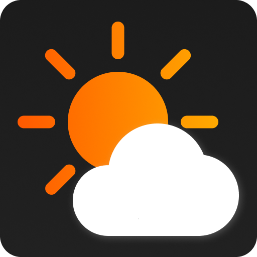

# Weather App

- Data by [open-meteo.com](https://open-meteo.com/en/)
- Charts made with [Chart.js](https://www.chartjs.org/)
- Icons: [Bootstrap Icons](https://icons.getbootstrap.com/)

Using open-meteo's:

- [Weather Forecast API](https://open-meteo.com/en/docs)
- [Geocoding API](https://open-meteo.com/en/docs/geocoding-api)
- [Air Quality API](https://open-meteo.com/en/docs/air-quality-api)
